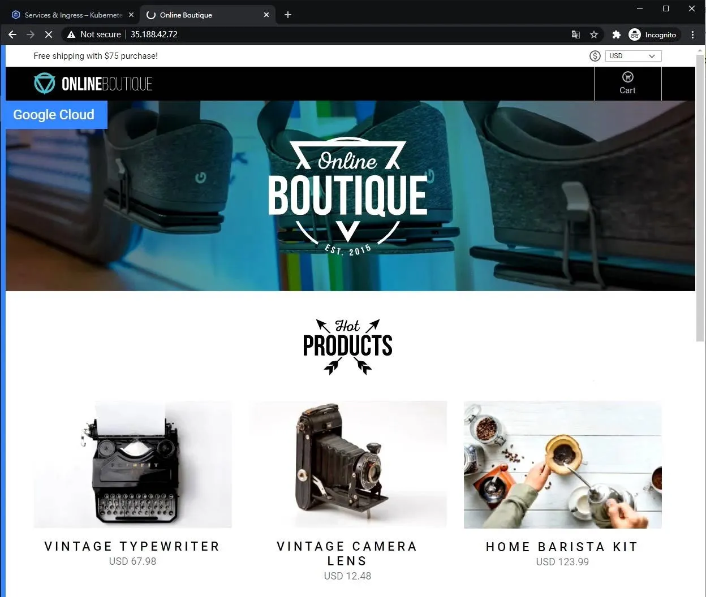

Set the zone as a variable in the Cloud Shell.

```bash
ZONE=us-central1-a
kubectl create namespace dev
kubectl create namespace prod
```

Initially application will be deployed into dev namespace. Switch the current namespace from default to dev:
```bash
kubectl config set-context --current --namespace dev
```

Copy the application files to the Shell environment, and then deploy the OnlineBoutique app to GKE:

```bash
git clone https://github.com/GoogleCloudPlatform/microservices-demo.git
cd microservices-demo
kubectl apply -f ./release/kubernetes-manifests.yaml --namespace dev
```

Wait until the load balancer exposes an External IP for the frontend-external service. You can monitor the service status using the following command:

```bash
kubectl get svc -w --namespace dev
```

Open http://<EXTERNAL_IP> in a new tab. The homepage of the Online Boutique application like this:

