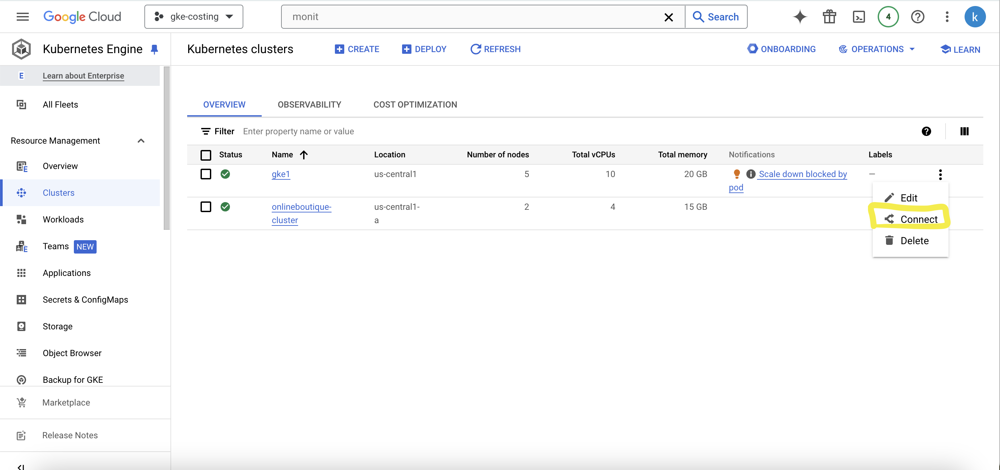
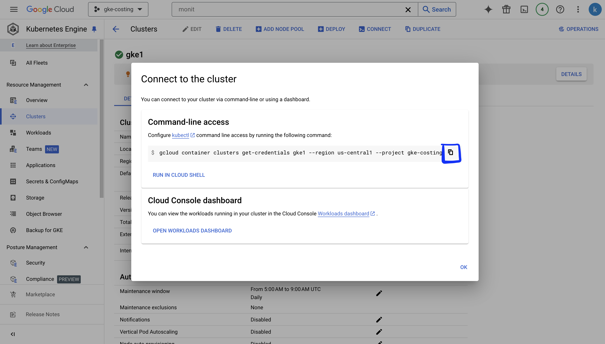
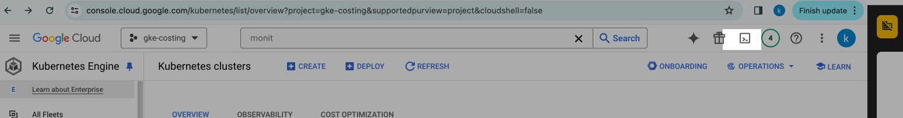
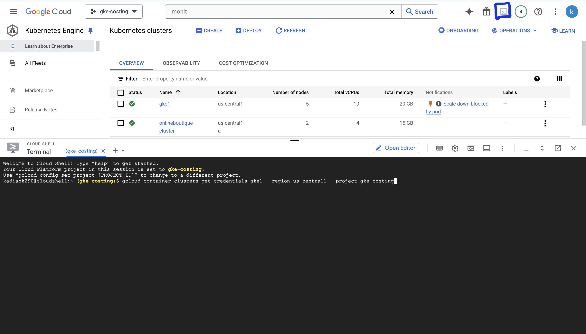
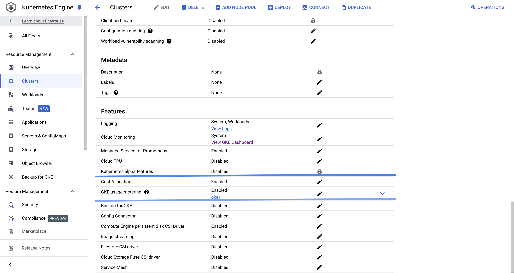
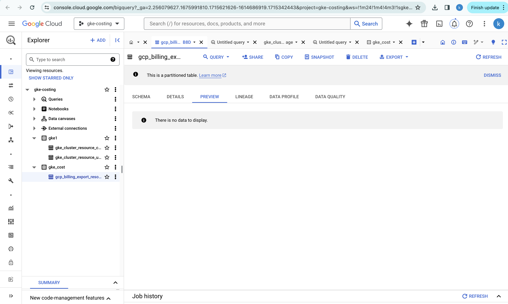
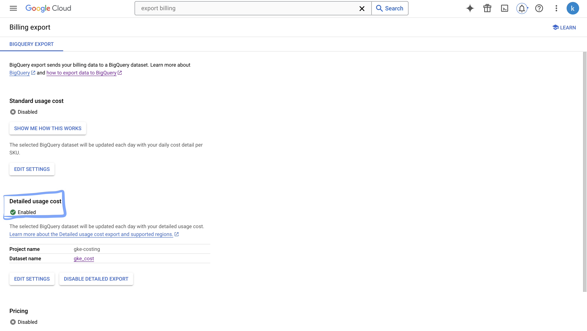
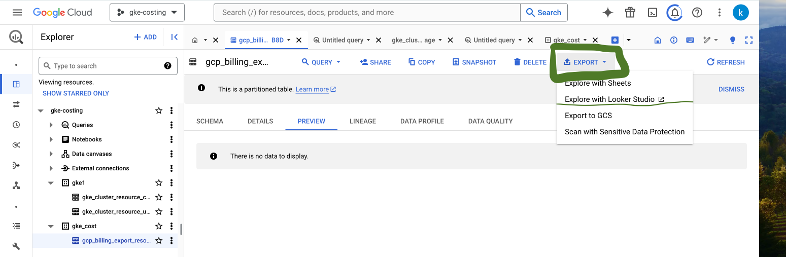

# gke-cost-optimisation

GKE cost optimisation with Resources usage metrics.

### 1. Creating GKE cluster

**Prerequisites:** 
- VPC 
- Network (If not created then it will use default subnet)

**Note:** In this Kubernetes cluster creation, GKE and VPC modules are used.

1. Download this repo and login into GCP cloud:

```bash
gcloud auth application-default login
```

This command redirects to browser login for user authentication. After login, the token is copied to the local machine, eliminating the need for a service account key for Terraform creation.

2. Provide the cluster details into Terraform main.tf:
- Project_id
- GKE name
- VPC name
- Cluster location (region, zones)
- Network
- Subnetwork
- Subnet IP 

3. Once the GKE cluster is ready, log in to the GKE cluster:
- Click on Kubernetes Clusters in the GCP console -> click on connect 

 

copy GKE connect command -> enter this command into the local terminal.


**or**


- Log in to GCP cloud -> Enable cloud shell


 click on Clusters -> click on connect 
 
 copy GKE connect command -> enter this command into GCP cloud shell.


### 2. Enable GKE Cost Allocation 

**Prerequisites:** 
Bigquery Dataset

**Using Gcloud CLI:**

```bash
gcloud container clusters update gke1 enable-resource-consumption-metering --zone us-central1-a --resource-usage-bigquery-dataset gke-costing
```

**Using GUI:**
- Create a dataset in BigQuery (already provisioned in Terraform).
- Click on GKE cluster -> scroll down to features -> click on edit -> enable cost allocation -> select BigQuery dataset -> click on edit -> GKE Usage Metrics -> select BigQuery dataset.



**Follow Below Link for understanding the usage metrics:**
[Understand the Cloud Billing data tables in BigQuery](https://cloud.google.com/billing/docs/how-to/export-data-bigquery-tables)

### 3. Enabled GKE usage metering 

**Prerequisites:** 
Bigquery Dataset

**Gcloud CLI:**
```bash
gcloud container clusters update gke1 --resource-usage-bigquery-dataset gke-cost
```

**Using GUI:**
- Click on GKE cluster -> scroll down to features -> click on edit -> GKE Usage Metrics -> select BigQuery dataset -> select Enable network data transfer metering -> select Enable resource consumption metering. Refer above screenshot

It will create below 2 tables in BigQuery dataset. 



**Follow Below Link for understanding the usage metrics:**
[Understanding cluster resource usage](https://cloud.google.com/kubernetes-engine/docs/how-to/cluster-usage-metering?&_gl=1*hhh71d*_ga*MTYxNDY4NjkxOS4xNzE1MzQyNDQz*_ga_WH2QY8WWF5*MTcxNTc1MjAyMy45LjEuMTcxNTc1MzcyMS4wLjAuMA..&_ga=2.98374303.-1614686919.1715342443#view_in_data-studio)

### 4. Export GCP Billing
- Search Export billing in Google cloud search bar -> Select Details usage billing -> Select Project Name -> Dataset Name.
- Once it is enabled, it will create a billing-export table in the BigQuery dataset.


### 5. Explore Looker Studio
- Once every data is published into all tables, select Looker Studio for data Exploration.
- Click on Export -> Explore data with Looker Studio.



[Example queries for Cloud Billing data export](https://cloud.google.com/billing/docs/how-to/bq-examples#sum-costs-per-invoice)

## Few Best Practices Link 

#### Best practices for running cost-optimized Kubernetes applications on GKE 
[Best Practices](https://cloud.google.com/architecture/best-practices-for-running-cost-effective-kubernetes-applications-on-gke)

